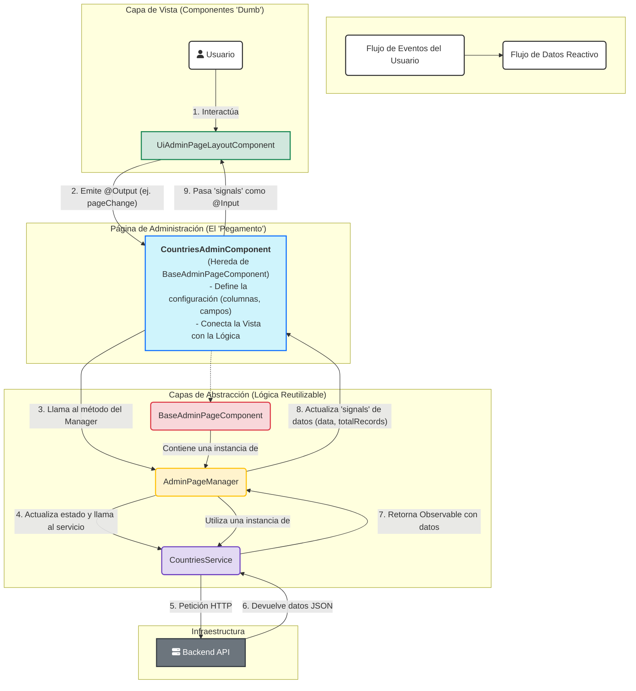

<!-- File: d:\desarrollos\countries2\documentación\FRONTEND_ADMIN_PATTERN_DIAGRAM.md | Last Modified: 2025-10-28 -->

# Diagrama de Arquitectura: Patrón de Páginas de Administración

Este diagrama ilustra el flujo de datos y eventos en la arquitectura de páginas de administración del frontend.

### Cómo Funciona el Patrón (Explicación del Diagrama):

1.  **Interacción del Usuario**: El usuario hace clic en un botón de paginación o escribe en la barra de búsqueda dentro del `UiAdminPageLayoutComponent`.
2.  **Emisión de Evento**: El componente de layout, al ser "tonto", no sabe qué hacer. Simplemente emite un evento (`@Output`), como `pageChange` o `searchChange`.
3.  **Manejo del Evento**: La página específica (ej. `CountriesAdminComponent`) captura este evento en su plantilla y llama al método correspondiente en la instancia del `AdminPageManager` (heredada de `BaseAdminPageComponent`).
4.  **Gestión de Estado**: El `AdminPageManager` actualiza su estado interno (ej. el `signal` de la página actual) y orquesta la llamada al servicio para obtener los nuevos datos.
5.  **Llamada a la API**: El servicio (`CountriesService`) realiza la petición HTTP al backend.
6.  **Retorno de Datos**: La API devuelve los datos solicitados.
7.  **Actualización de Estado**: El `AdminPageManager` recibe los datos y actualiza sus `signals` públicos (ej. `data()`, `totalRecords()`).
8.  **Flujo de Datos Reactivo**: Como la plantilla del `CountriesAdminComponent` enlaza los `@Input` del `UiAdminPageLayoutComponent` directamente a los `signals` del `manager` (`[data]="manager.data()"`), Angular detecta el cambio y actualiza automáticamente la vista.

Este ciclo **desacoplado y reactivo** es el corazón de la arquitectura, permitiendo que sea robusta, fácil de mantener y muy eficiente.