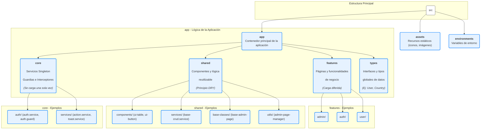

<!-- File: d:\desarrollos\countries2\documentación\FRONTEND_DIRECTORY_DIAGRAM.md | Last Modified: 2025-10-29 -->

# Diagrama de Estructura de Directorios del Frontend

Este diagrama ilustra la arquitectura de directorios principal de la aplicación frontend, destacando la separación de responsabilidades entre las carpetas `core`, `features`, `shared` y `types`.

Este diagrama proporciona una visión clara y de alto nivel de cómo está organizado el frontend, lo que es extremadamente útil para la incorporación de nuevos desarrolladores y para mantener una comprensión compartida de la arquitectura.

---

## Descripción de Directorios Principales

### `core`
-   **Propósito**: Contiene la lógica fundamental que se carga **una sola vez** al iniciar la aplicación. Son los cimientos del frontend.
-   **Contenido Típico**:
    -   Servicios Singleton (`AuthService`, `ActionService`, `LayoutService`).
    -   Guardias de Ruta (`AuthGuard`, `AdminGuard`).
    -   Interceptores HTTP (`AuthInterceptor`).

### `features`
-   **Propósito**: El corazón de la aplicación. Cada subdirectorio representa una funcionalidad o "página" principal, diseñada para ser cargada de forma diferida (`lazy loading`).
-   **Contenido Típico**:
    -   Páginas de administración (`/admin`).
    -   Páginas de autenticación (`/auth`).
    -   Páginas de perfil de usuario (`/user`).

### `shared`
-   **Propósito**: El arsenal de componentes y utilidades **reutilizables** en diferentes `features`. Es la clave de la filosofía DRY (Don't Repeat Yourself).
-   **Contenido Típico**:
    -   Componentes de UI "tontos" (`ui-table`, `ui-button`, `ui-form-modal`).
    -   Clases base (`BaseAdminPageComponent`).
    -   Servicios genéricos (`BaseCrudService`).

### `types`
-   **Propósito**: Ubicación centralizada para todas las definiciones de tipos e interfaces de datos globales (`User`, `Country`, `Continent`, etc.).
-   **Beneficio**: Desacopla las definiciones de datos de la lógica del `core`, mejorando la organización y claridad del proyecto.
<!--
[PROMPT_SUGGESTION]Sí, me parece perfecto. Empecemos por modificar el `UiDynamicFormComponent` y la interfaz `FormField` para que soporten el nuevo tipo `select`.[/PROMPT_SUGGESTION]
[PROMPT_SUGGESTION]Ahora que la documentación está completa, crea un script SQL (`init_db.sql`) que contenga todas las sentencias `CREATE TABLE` para ambas bases de datos.[/PROMPT_SUGGESTION]
